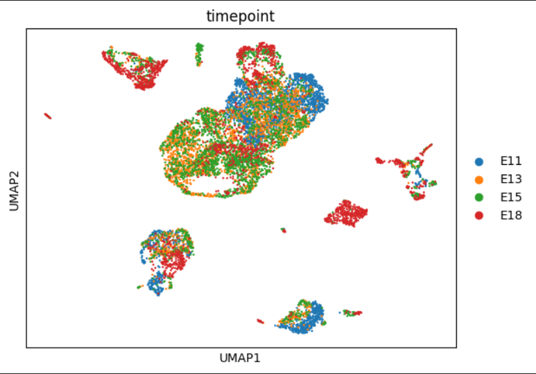
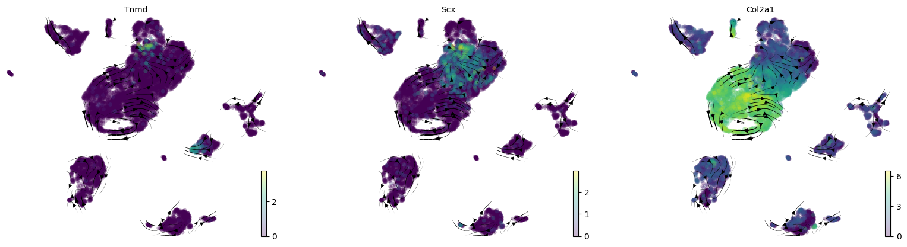

# Analysis of Col2a1+ Cell Fate in Mouse Limb Development

**Current Status:** Work in Progress (Jan 2026)
**Methodology:** scRNA-seq (10x Genomics) -> Scanpy -> scVI -> scVelo

## Project Overview
This project investigates the lineage specification of chondrogenic cells (Col2a1+) in the developing mouse limb. I am currently analyzing the [GSE142425](https://www.ncbi.nlm.nih.gov/geo/query/acc.cgi?acc=GSE142425) dataset to reconstruct developmental trajectories.

## Current Progress

### 1. Data Integration (scVI)
I successfully integrated multiple developmental timepoints (E11.5 - E15.5) using **scVI**. 
- **Left:** Raw data showing batch effects by sample.
- **Right:** scVI integrated embedding showing biological mixing.

### 2. RNA Velocity Analysis
Using **scVelo (dynamical mode)**, I recovered the vector field for the developing limb mesenchyme. The stream plot below confirms the directionality from Col2a1+ towards the tendon lineage.

## Tools Used
- **Language:** Python
- **Core:** Scanpy, AnnData
- **Integration:** scVI-tools
- **Trajectory:** scVelo (Dynamical Model)

---
*Note: Full code and processed objects will be released upon project completion/publication.*
